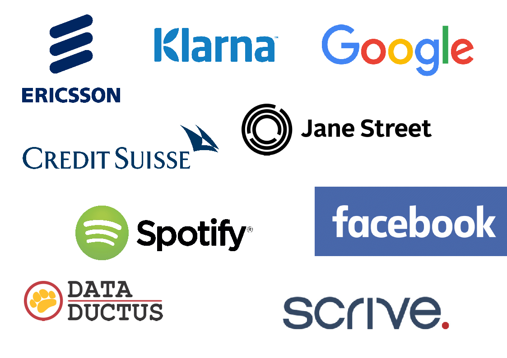

% Funktionell Programmering @ D&IT-inst.

* Vad innebär området i ett större perspektiv?
* Vilken spetsforskning inom området bedriver vi här på Chalmers och Göteborgs Universitet?
* I vilka kurser lär jag mig mer om området?


Vad är funktionell programmering (för oss)?
================================================================
(Exempel i [Haskell](http://www.haskell.org/).)

* Mästerligt möte mellan matematik och maskin
* Ett fantastiskt flexibelt språk för (inte bara matematiska) uttryck
    * Algebra: ```3+4```, ```5/8```, ```(17+3)*(2 + 1)```, ...
    * Text: ```reverse "kirtaP"```, ```"Hej " ++ namn ++ "!"```, ...
    * Funktioner: ```area r = pi*r^2```, TODO: more examples
    * Kombinationer: ```let   area r = pi*r^2   in  (area 2) / (area 1)```
* Korta och koncisa definitioner
* Typer som hjälper programmeraren att undvika fel
* Kontrollerade sidoeffekter ger bra parallellism och korrekthet

Några funktionella språk:

* Lisp, Scheme, Clojure, JavaScript, Erlang
* Haskell, ML, Clean, Miranda och F#.


Vad innebär Funktionell Programmering i ett större perspektiv?
================

Företag? TODO: EmAx

* [Functional Jobs](http://functionaljobs.com/)
* Facebook, Google, Standard Chartered, Microsoft Research, Klarna, ...
* Galois, FP-Complete, WellTyped, Quviq, ...


Annat?

Vad innebär Funktionell Programmering i ett större perspektiv?
================

  


Spetsforskning inom Funktionell Programmering här i Göteborg
================

TODO: fyll på om säkerhet, språkteknologi, etc.

* Test-verktyget QuickCheck (för Haskell och Erlang)
* Prisbelönta logikverktyg
    * MiniSat SAT-solver
    * Paradox model finder
* Nya programspråk
    * Haskell (delar av språket design, kompilatorer, bibliotek, verktyg)
    * Agda (funktionell programmering möter bevissystem)
* Utveckling av "generisk" funktionell programmerin (polytypisk programmering)
* Domänspecifika språk (DSL = Domain Specific Languages)
    * Lava, Wired för att beskriva hårdvara
    * QuickCheck för automatisk testning och specifikation
    * Feldspar för digital signalbehandling och programmering av inbyggda system
    * Grammatical Framework - för grammatiker och naturliga språk

TODO: PaJa - något klimateffektforskning eller globala system

Länkar:
* [FP-gruppen](http://wiki.portal.chalmers.se/cse/pmwiki.php/FP/FP),


Varför lära sig om Funktionell Programmering?
=====================

* Rapid prototyping = det går *snabbt* att få fungerande program
* strong type system = datorn hjälper dig att göra rätt
* powerful design patterns = programsnuttar kan återanvändas mycket flexibelt
* conceptual clarity = tydlig mening
* industrial strength compilers = mycket bra kompilatorer
* promising parallelisation properties = lovande egenskaper för parallellisering


I vilka kurser lär jag mig mer om Funktionell Programmering?
================

* Kandidatnivån (första tre åren):
    * LP1: IFP = [Introduktion till Funktionell Programmering](http://www.cse.chalmers.se/edu/course/TDA555/), Emil Axelsson
    * LP2: FP = [Functional Programming](www.cse.chalmers.se/edu/course/TDA452/), Dave Sands
    * LP3: DSLM = [Domain Specific Languages of Mathematics](https://github.com/DSLsofMath), Ionescu & Jansson
    * (LP3: ProgPara = [Programming Paradigms](http://www.cse.chalmers.se/~bernardy/pp/), Bernardy, inställd våren 2015)
    * LP3-4: Kandidatarbete - beroende på projektval
* Masternivån (sista två åren):
    * LP1: Types = [Types for Programs and Proofs](http://www.cse.chalmers.se/edu/course/DAT140/), Coquand, Dybjer, Norell
    * LP2: PLT = [Programming Language Technology](http://www.cse.chalmers.se/edu/course/DAT151_Programming_Language_Technology/), Andreas Abel
    * LP2: Models = [Models of Computation](https://sites.google.com/site/modelsofcomputation/)
    * LP3: AFP = [Advanced Functional Programming](http://www.cse.chalmers.se/edu/course/afp/), Patrik Jansson
    * LP4: PFP = [Parallel Functional Programming](http://www.cse.chalmers.se/edu/course/DAT280_Parallel_Functional_Programming/), Mary Sheeran & John Hughes
    * LP4: Comp = [Compiler Construction](http://www.cse.chalmers.se/edu/course/TDA283/), Josef Svenningsson -> Thomas Hallgren
    * ...

Mer om kurserna i de tre första åren
=============

* (Introduktion till) Funktionell programmering (År 1, LP1 för D, DV) och valfri för IT (År 3, LP2)
    * Programspråket Haskell, rekursion, datatyper, testning, ...
* År 2-3: DSLM = [Matematikens domänspecifika språk](https://github.com/DSLsofMath), Cezar Ionescu, Patrik Jansson
    * Exempel på domänspecifika språk: datum, algebraiska uttryck, integraler
    * Förstå centrala matematiska begrepp genom programmering och tvärtom!
    * Fokus på lämplig notation för matematik (därav "språk" i titeln)
    * Genomföra och räkna med bevis
* AFP = [Avancerad funktionell programmering](http://www.cse.chalmers.se/edu/course/afp/), Patrik Jansson
    * Haskell i industri och teori
    * Domänspecifika språk som programvaruarkitektur
    * Matematik möter maskinen: Funktorer, monader, transformer
    * Testning och bevis
* PLT = [Programspråksteknologi](http://www.cse.chalmers.se/edu/course/DAT151_Programming_Language_Technology/), Andreas Abel
    * Hur implementerar man ett programspråk? (fokus på "front-end")
* Comp = [Kompilatorkonstruktion](http://www.cse.chalmers.se/edu/course/TDA283/), Josef Svenningsson -> Thomas Hallgren
    * Hur implementerar man ett programspråk? (fokus på "back-end")


**Pre-writing:**
================

Personer
================

* John Hughes: [on wikipedia](https://en.wikipedia.org/wiki/John_Hughes_(computer_scientist))
* Mary Sheeran: [ICFP keynote 2015](https://www.youtube.com/watch?v=gz8JpdAwtuo&index=15&list=PLnqUlCo055hWNtUo1Haoq347VhCqIjs7u) [slides](http://icfpconference.org/icfp2015/sheeran-keynote.pdf)
* Koen Claessen: [QuickCheck](https://en.wikipedia.org/wiki/QuickCheck), Aktuellt: kursen [Diskret matematik för datavetare](http://www.cse.chalmers.se/edu/course/DIT980/)
* Patrik Jansson: Står här! [Github](https://github.com/patrikja) Aktuellt: [ProfLect](https://github.com/patrikja/ProfLect)
* Emil Axelsson:
* Niklas Broberg:

TODO: fyll på med fler ...
TODO: fyll på med mer information


Feldspar
================

<http://feldspar.github.io/>

* Ett funktionellt språk för numeriska beräkningar
* Implementerat som ett bibliotek i Haskell
* Avsett för inbyggda system, t.ex. basstationer för telekom
* **In:** funktionell kod på hög nivå

~~~~{.haskell}
-- Antenna combining in LTE receiver
antennaComb chs = map average       -- Average across antennas
                . transpose         -- Swap dimensions
                . zipWith (.*) chs  -- Compensate for channel distortion
~~~~

* **Ut:** optimerad C-kod

~~~~{.c}
void antenna_comb(struct array * v0, struct array * v1, struct array * out) {
    initArray(out, sizeof(float complex), 1024);
    for(uint32_t v2 = 0; v2 < 1024; v2 += 1) {
        float complex e0;
        float complex v4;
        e0 = (0.0f+0.0fi);
        for(uint32_t v3 = 0; v3 < 4; v3 += 1) {
            v4 = (e0 + (at(float complex,&at(struct array,v0,v3),v2)
                      * at(float complex,&at(struct array,v1,v3),v2)));
            e0 = v4; }
        at(float complex,out,v2) = (e0 / (4.0f+0.0fi)); } }
~~~~


Historia
================

Exempel:

* Fortsättningskursen "Avancerad funktionell programmering" har getts varje år sedan 1993:
    * 1993: John Hughes, 1995: Magnus Carlsson, 1999: Lennart Augustsson, 2000: Koen Claessen, 2003: Josef Svenningsson, 2008: Ulf Norell, 2010 och framåt: Patrik Jansson

Matematikens domänspecifika språk
================

* Ny kurs i LP3 2016 för Chalmers och GU.
* Valfri för D, DV, IT, TM, ...

* Examinator: Patrik Jansson
* Föreläsare: Cezar Ionescu

Förkunskaper: "ett års studier"

* en kurs i diskret matematik (pågår)
* två andra kurser i matematik (exampelvis Linjär algebra och Analys)
* två kurser i datateknik (exemeplvis två kurser i programmering)
* ytterligare tre kurser (22.5hp) inom matematik, data eller IT


Kursen presenterar klassiska matematiska ämnen från ett
datavetenskaligt perspektiv: genom att specificera de introducerade
begreppen, vara uppmärksam på syntax och typer, och slutligen genom
att bygga domänspecifika språk för vissa av de matematiska områden som
nämns nedan.

DSLsofMath: Lärandemål
================

* designa och implementera ett domänspecifikt språk (DSL) för en ny domän
* strukturera delområden inom matematik i termer av DSL
* förklara de centrala begreppen i grudläggande reell och complex anays, algebra och linjär algebra

* utveckla lämplig notation för matematiska koncept
* genomföra och kalkylera bevis
* använda potensserier för att lösa differentialekvationer
* använda Laplace-transformer för att lösa differentialekvationer

* diskutera och jämföra olika implementationer av matematiska begrepp

Föreläsningarna kommer att behandla:

* Introduktion till funktionell programmering, programkalkyl och bevis
* Introduktion till domänspecifika språk (DSL) med linjär algebra som exempel
* DSL och matematik: kategoriteori som exempel
* Reell analys: medelvärdessatser, Taylors formuler
* Reell analys: ett DSL för potensserier
* Mer linjär algebra: egenvärden och optimering

DSLsofMath: motivation
================

Programmering och matematik är väldigt närliggande ämnen

TODO: Återanvänd en del av detta från början:

* Mästerligt möte mellan matematik och maskin
* Ett fantastiskt flexibelt språk för (inte bara matematiska) uttryck
    * Algebra: ```3+4```, ```5/8```, ```(17+3)*(2 + 1)```, ...
    * Text: ```reverse "kirtaP"```, ```"Hej " ++ namn ++ "!"```, ...
    * Funktioner: ```area r = pi*r^2```, TODO: more examples
    * Kombinationer: ```let   area r = pi*r^2   in  (area 2) / (area 1)```
* Korta och koncisa definitioner
* Typer som hjälper programmeraren att undvika fel
* Kontrollerade sidoeffekter ger bra parallellism och korrekthet

TODO: abstract till
  http://www.cse.chalmers.se/edu/course/CSE-seminarier/

----------------

Länkar till "Jobs in Functional Programming" på Chalmers 2007!
* http://www.cse.chalmers.se/~rjmh/jobs-in-fp/
* http://www.cse.chalmers.se/~rjmh/jobs-in-fp/jobs%20photos/content/DSC_6154_large.html
